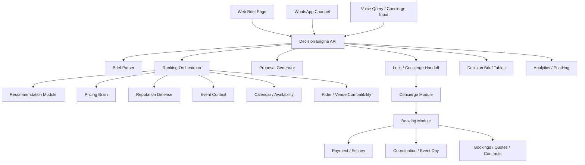

# Slash for Events — System Architecture

## Document Status
- Version: 2.0
- Date: 2026-03-28
- Purpose: Define the target architecture for the decision-first event intelligence workflow while preserving the current ArtistBook monorepo and production systems.

## 1. Architecture Principles
1. Reuse the current monorepo and module boundaries.
2. Add orchestration rather than duplicate business logic.
3. Keep the first-use decision flow thin, fast, and channel-agnostic.
4. Route accepted recommendations into existing booking and operations systems.
5. Capture all decision funnel events as durable data.

## 2. Current Platform Foundation
The current platform provides:
- Fastify REST API backend
- Next.js App Router frontend
- shared schemas/types in `packages/shared`
- Knex migrations and seeds in `packages/db`
- Redis cache
- Supabase Postgres
- existing modules for booking, pricing, recommendation, concierge, document generation, WhatsApp, voice, and workspace

This means the new architecture should be an **incremental layer**.

## 3. High-Level Architecture


## 4. Monorepo Placement
### 4.1 Existing Packages
- `apps/api`
- `apps/web`
- `packages/shared`
- `packages/ui`
- `packages/db`

### 4.2 New Module
Create a new backend module:

```txt
apps/api/src/modules/decision-engine/
  decision-engine.module.ts
  decision-engine.controller.ts
  decision-engine.service.ts
  decision-engine.repository.ts
  decision-engine.schemas.ts
  decision-engine.types.ts
```

Create matching shared schemas:

```txt
packages/shared/src/decision-engine.ts
```

Optional web app placement:

```txt
apps/web/src/app/brief/page.tsx
apps/web/src/components/decision/
```

## 5. Service Responsibilities
### 5.1 Decision Engine Module
Responsibilities:
- accept structured or parsed briefs
- normalize and validate brief input
- orchestrate ranking across existing modules
- persist brief and recommendation output
- generate proposal requests
- create concierge lock handoff
- emit analytics events

Non-responsibilities:
- raw artist search index maintenance
- payment state machine logic
- contract rendering internals
- full booking orchestration internals

### 5.2 Recommendation Module
Responsibilities retained:
- candidate generation
- similarity and ranking helpers
- artist-based recommendation logic

### 5.3 Pricing Brain
Responsibilities retained:
- market range lookup
- expected price guidance
- percentile / city-aware pricing context

### 5.4 Reputation Defense
Responsibilities retained:
- trust and failure scoring
- reliability-based risk signals

### 5.5 Event Context
Responsibilities retained:
- event metadata enrichment
- audience/vibe fit scoring signals

### 5.6 Concierge + Booking
Responsibilities retained:
- human-assisted lock
- quote creation
- negotiation state handling
- booking machine and confirmation flow

## 6. Data Flow
### 6.1 Brief Creation
1. User submits raw text or structured brief.
2. `decision-engine` validates or parses it.
3. Brief is stored in `decision_briefs`.
4. Analytics event `brief_created` emitted.

### 6.2 Recommendation Generation
1. `decision-engine` requests candidate set from recommendation/search.
2. Candidate set enriched with pricing, reputation, event context, and availability/rider signals.
3. Hard filters remove impossible options.
4. Weighted score is applied.
5. Top-ranked results stored in `decision_recommendations`.
6. Analytics event `recommendation_returned` emitted.

### 6.3 Proposal
1. User requests proposal.
2. `decision-engine` builds proposal payload from brief + selected recommendations.
3. Existing `document` module renders PDF.
4. Proposal metadata persisted and event logged.

### 6.4 Lock / Handoff
1. User selects a recommendation.
2. `decision-engine` creates lock request.
3. Existing `concierge` module receives enriched context.
4. Concierge may escalate to booking state machine.
5. Funnel events continue from brief into booking.

## 7. Data Model
### 7.1 Tables
#### `decision_briefs`
- `id` uuid pk
- `source` text
- `raw_text` text nullable
- `structured_brief` jsonb
- `status` text
- `created_by_user_id` uuid nullable
- `workspace_id` uuid nullable
- `selected_recommendation_id` uuid nullable
- `created_at` timestamptz
- `updated_at` timestamptz

Indexes:
- `(created_by_user_id, created_at desc)`
- `(workspace_id, created_at desc)`
- `(status)`

#### `decision_recommendations`
- `id` uuid pk
- `brief_id` uuid fk -> decision_briefs.id
- `artist_id` uuid fk -> artists.id
- `score` numeric(5,2)
- `confidence` text
- `price_min` numeric(12,2)
- `price_max` numeric(12,2)
- `expected_close` numeric(12,2) nullable
- `reasons` jsonb
- `risk_flags` jsonb
- `logistics_flags` jsonb
- `rank` int
- `created_at` timestamptz

Indexes:
- `(brief_id, rank)`
- `(artist_id)`

#### `decision_events`
- `id` uuid pk
- `brief_id` uuid fk -> decision_briefs.id
- `event_type` text
- `payload` jsonb
- `created_at` timestamptz

Indexes:
- `(brief_id, created_at)`
- `(event_type, created_at)`

## 8. Shared Contracts
All request/response shapes must live in `packages/shared` as Zod schemas and exported TS types.

Suggested schemas:
- `DecisionBriefSchema`
- `DecisionParsedBriefSchema`
- `DecisionRecommendationSchema`
- `DecisionResponseSchema`
- `DecisionProposalRequestSchema`
- `DecisionLockRequestSchema`

## 9. API Design
### POST `/decision-engine/parse`
Purpose:
- parse raw text into structured brief

Request:
```json
{
  "rawText": "Delhi wedding 400 pax Punjabi vibe budget 8 lakh"
}
```

Response:
```json
{
  "parsed": {
    "eventType": "wedding",
    "city": "Delhi",
    "audienceSize": 400,
    "budgetMax": 800000,
    "vibe": "Punjabi"
  },
  "missing": []
}
```

### POST `/decision-engine/brief`
Purpose:
- create and score a decision brief

Request:
```json
{
  "eventType": "wedding",
  "city": "Delhi",
  "audienceSize": 400,
  "budgetMax": 800000,
  "vibe": "Punjabi",
  "familySafe": true,
  "format": "artist"
}
```

Response:
```json
{
  "briefId": "uuid",
  "summary": "Best fits for a Punjabi wedding in Delhi for 400 guests.",
  "recommendations": [
    {
      "artistId": "uuid",
      "artistName": "Artist A",
      "score": 88,
      "confidence": "high",
      "priceRange": {
        "min": 500000,
        "max": 700000,
        "expectedClose": 620000
      },
      "whyFit": ["Strong Punjabi wedding fit", "High completion reliability"],
      "riskFlags": [],
      "logisticsFlags": []
    }
  ]
}
```

### POST `/decision-engine/:briefId/proposal`
Purpose:
- generate proposal using current brief and recommendations

### POST `/decision-engine/:briefId/lock`
Purpose:
- hand off selected option to concierge/booking

### GET `/decision-engine/:briefId`
Purpose:
- retrieve brief details, current recommendation set, and current status

## 10. Ranking Pipeline
### 10.1 Candidate Generation
Sources:
- recommendation/search
- shortlist affinity if a workspace/client exists
- city and format filters

### 10.2 Enrichment
For each candidate, fetch:
- pricing range
- reputation/risk score
- event-type relevance
- audience/vibe relevance
- city and travel/logistics context
- availability signal
- rider/venue compatibility signal if known

### 10.3 Hard Filters
Remove candidates that fail:
- availability threshold
- family-safe or brand-safe threshold
- budget floor/ceiling mismatch
- unacceptable logistics/rider mismatch
- severe reliability threshold

### 10.4 Weighted Score
Initial score:
- Event-type match: 25%
- Audience-vibe match: 20%
- Budget fit: 20%
- Reliability: 15%
- City/logistics fit: 10%
- Demand momentum: 5%
- Strategic upside: 5%

### 10.5 Explainability
Generate a bounded list of:
- `whyFit`
- `riskFlags`
- `logisticsFlags`

This should be deterministic where possible and not rely fully on freeform generation.

## 11. Channel Architecture
### 11.1 Web
- public brief page posts directly to `decision-engine`
- proposal and lock actions post to the corresponding endpoints
- uses existing auth if available, but first-use should not require login

### 11.2 WhatsApp
- existing WhatsApp state machine should add a `CREATE_BRIEF` path
- after parse, if one critical field is missing, ask a single clarifying question
- after scoring, return the top 3 options with quick replies

### 11.3 Voice
- existing voice-query stack can route eligible intent into `decision-engine/parse` or direct brief creation
- voice remains a front-end interaction layer, not a separate backend architecture

## 12. Proposal Generation Architecture
Proposal generation should remain in the `document` module.

The `decision-engine` composes:
- brief summary
- recommended shortlist
- pricing ranges
- reasons/risk notes

The `document` module renders the PDF and returns artifact metadata.

## 13. Analytics Architecture
Emit events from the `decision-engine` and downstream modules.

Required events:
- `brief_created`
- `brief_parse_failed`
- `recommendation_returned`
- `proposal_generated`
- `lock_requested`
- `booking_created`
- `brief_dropped`

PostHog remains the product analytics sink; relational tables remain the source of truth for deal intelligence.

## 14. Caching
Recommended caching strategy:
- candidate search result cache: short TTL (1-2 min)
- pricing range cache: short TTL (5 min)
- decision response cache: only for idempotent GET retrieval, not during active recompute

Do not cache user-visible ranking aggressively while logic is still changing.

## 15. Security
Existing security practices remain applicable:
- auth middleware for protected operations
- validation middleware for decision payloads
- rate limiting on public brief creation endpoints if exposed openly
- request logging with PII hygiene
- no direct trust in channel payloads from WhatsApp or voice

## 16. Failure Modes and Fallbacks
### Parse Failure
Fallback to requesting a minimal structured prompt with missing fields.

### Low-Confidence Recommendations
Still return output, but tag as low confidence and encourage concierge review.

### Downstream Module Failure
If proposal generation or booking handoff fails, preserve the brief and recommendation data and surface a retry-safe state.

### Pricing Uncertainty
If certainty is weak, return broader market range and label expected close as unavailable.

## 17. Observability
Required telemetry:
- endpoint latency
- parse failure rate
- time to recommendation
- proposal generation failure rate
- lock handoff failure rate
- close-price variance reporting job

## 18. Deployment Notes
No deployment model change is required.

API:
- remains on Render
- remember shared package must build first

Web:
- remains on Vercel
- public brief page must use `NEXT_PUBLIC_API_URL`

Database:
- new migrations go through `packages/db`

## 19. Migration Strategy
1. add shared contracts
2. add new DB tables
3. add `decision-engine` module behind feature flag if desired
4. ship web brief page
5. wire WhatsApp path
6. enable internal and founder-led use first
7. roll out external usage to select agencies

## 20. Architectural Outcome
This architecture keeps the current platform intact while introducing one new orchestrator that turns the existing system into a fast decision surface. It avoids a rebuild, creates a durable event-level data model, and aligns the product around the strongest wedge: decisive, explainable recommendations that convert into transactions.
